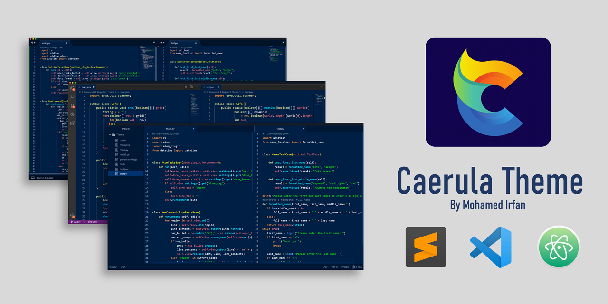
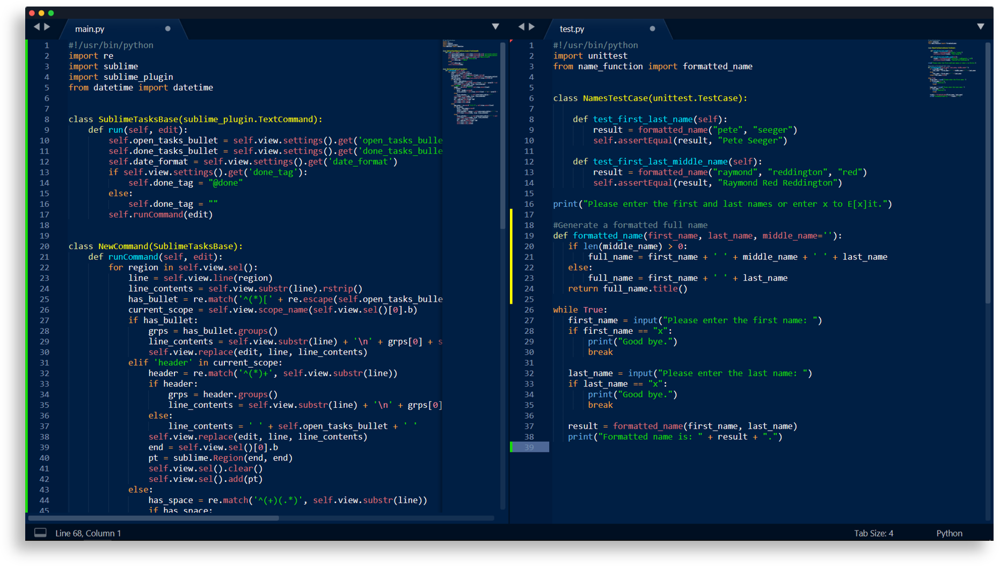
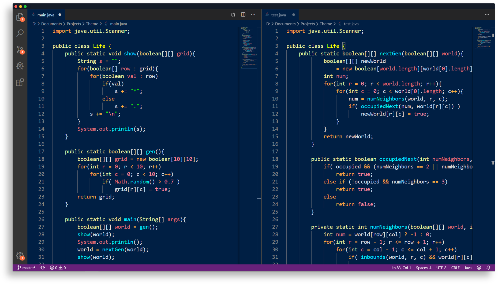
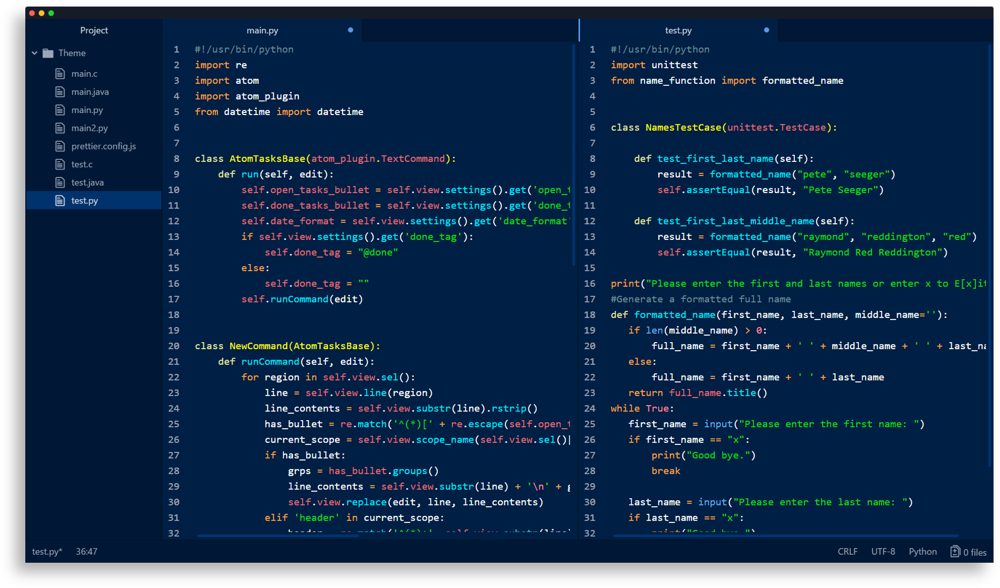

<p align="center">
  
</p>
<h1 align="center">
  Caerula Theme
</h1>
<p align="center">
  A minimal, high contrast, dark blue theme for Sublime Text, VS Code and Atom.
</p>
<p align="center">
    
    
    
    
    <a href="https://github.com/mohamedirfansh/Caerula-Theme/blob/master/LICENSE">
        
    </a>
</p>



## 📸 Demo
### Sublime Text


### VS Code


### Atom


## ⬇️ Downloading
Download the theme by either using the [GitHub .zip download](https://github.com/mohamedirfansh/Caerula-Theme/archive/master.zip) option or by running this command in your terminal:
```
git clone https://github.com/mohamedirfansh/Caerula-Theme.git
```

## ⚡️ Installing and Activating

### Sublime Text

1. Open Sublime Text and click on **Preferences -> Browse Packages** . 

2. Navigate to the `sublime` folder: `Caerula-Theme/sublime`.

3. Copy the folder named `Caerula Theme` to the **Packages** folder in Sublime Text.

4. Activate the theme by going to **Preferences -> Color Scheme** then select `Caerula` and enjoy! 😄

> Note: If Caerula doesn't appear restart Sublime Text and repeat step 4.

### VS Code

1. Navigate to the `vscode` folder: `Caerula-Theme/vscode`.

2. Copy the folder named `caerula-theme` to the VS Code extension directory which:
    + on **Windows** is at `%USERPROFILE%\.vscode\extensions`
    + on **Mac/Linux** is at `$HOME/.vscode/extensions`

3. Activate the theme by going to **File -> Preferences -> Color Theme** then select `Caerula` and enjoy! 😄

> Note: If Caerula doesn't appear restart VS Code and repeat step 3.

### Atom

1. Navigate to the `atom` folder: `Caerula-Theme/atom`.

2. Copy the folder named `caerula-syntax` to the Atom extension directory which:
    + on **Windows** is at `%USERPROFILE%\.atom\packages`
    + on **Mac/Linux** is at `$HOME/.atom/packages`

3. Activate the theme by going to **Settings -> Themes -> Syntax Theme** then select `Caerula` and enjoy! 😄

> Note: If Caerula doesn't appear restart Atom and repeat step 3.

## 🎨 Colour Palette


## 📄 License

[](https://github.com/mohamedirfansh/Caerula-Theme/blob/master/LICENSE)

This project is licensed under the **[MIT License](http://opensource.org/licenses/mit-license.php)** - see the [LICENSE](https://github.com/mohamedirfansh/Caerula-Theme/blob/master/LICENSE) file for more details.  
Copyright (c) 2020 Mohamed Irfan.