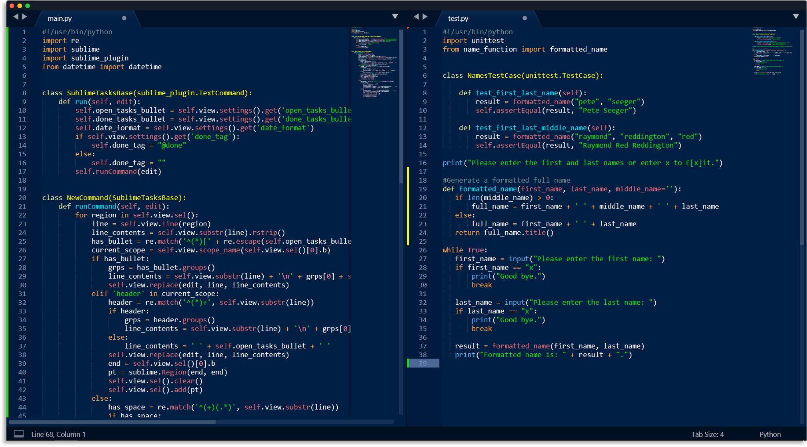
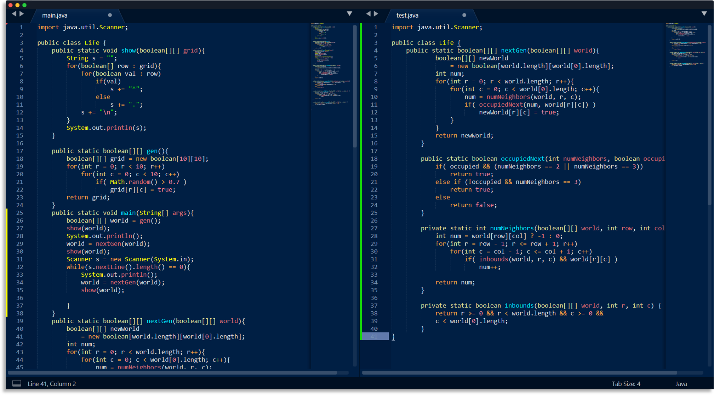
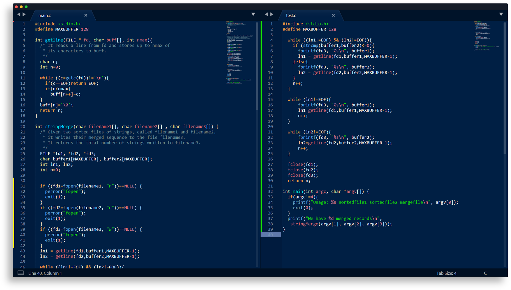

<p align="center">
  
</p>
<h1 align="center">
  Caerula Theme
</h1>
<p align="center">
  A minimal, dark blue theme for Sublime Text.
</p>
<p align="center">
    
    
    
    <a href="https://github.com/mohamedirfansh/Caerula-Theme/blob/master/LICENSE">
        
    </a>
</p>

## Demo
### Python


### Java


### C


## Downloading
Download the theme by either using the [GitHub .zip download](https://github.com/mohamedirfansh/Caerula-Theme/archive/master.zip) option or by running this command in your terminal:
```
git clone https://github.com/mohamedirfansh/Caerula-Theme.git
```

## Installing and Activating

### Sublime Text

1. Open Sublime text and click on **Preferences -> Browse Packages** .

2. Copy the folder named `Caerula-Sublime` to the **Packages** folder in Sublime Text.

3. Activate the theme by going to **Preferences -> Color Scheme** then click on `Caerula` and enjoy! 😄

### VS Code

1. --

### Atom

1. --

## Colour Palette

## License

[](https://github.com/mohamedirfansh/Caerula-Theme/blob/master/LICENSE)

This project is licensed under the **[MIT License](http://opensource.org/licenses/mit-license.php)** - see the [LICENSE](https://github.com/mohamedirfansh/Caerula-Theme/blob/master/LICENSE) file for more details.  
Copyright (c) 2020 Mohamed Irfan.