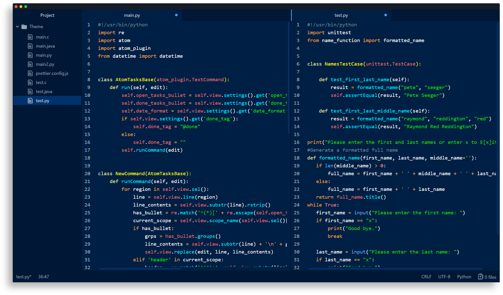

# Caerula Theme

🎨 A minimal, high contrast, dark blue theme for Atom!  
By: [Mohamed Irfan](https://github.com/mohamedirfansh)

## Installing on Atom

1. Copy the folder named `caerula-syntax` to the Atom extension directory which:
    + on **Windows** is at `%USERPROFILE%\.atom\packages`
    + on **Mac/Linux** is at `$HOME/.atom/packages`

2. Activate the theme by going to **Settings -> Themes -> Syntax Theme** then select `Caerula` and enjoy! 😄

> Note: If Caerula doesn't appear restart Atom and repeat step 2.

## GitHub Repository

You can view the GitHub repository for this theme [here](https://github.com/mohamedirfansh/Caerula-Theme).

## License

This project is licensed under the **[MIT License](http://opensource.org/licenses/mit-license.php)** - see the [LICENSE](https://github.com/mohamedirfansh/Caerula-Theme/blob/master/LICENSE) file for more details.  
Copyright (c) 2020 Mohamed Irfan.