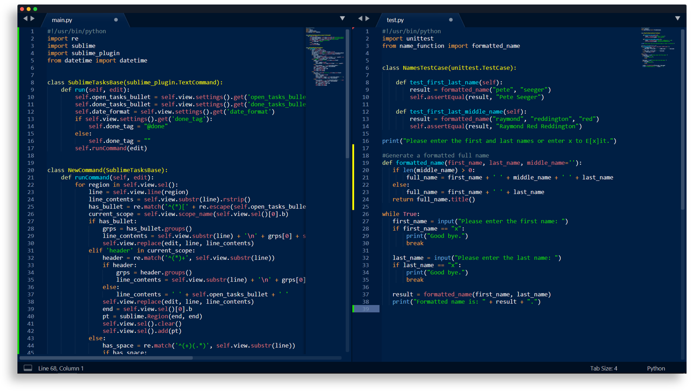

# Caerula Theme

🎨 A minimal, high contrast, dark blue theme for Sublime Text!  
By: [Mohamed Irfan](https://github.com/mohamedirfansh)

## Installing on Sublime Text

1. Open Sublime Text and click on **Preferences -> Browse Packages** . 

2. Copy the folder named `Caerula Theme` to the **Packages** folder in Sublime Text.

3. Activate the theme by going to **Preferences -> Color Scheme** then select `Caerula` and enjoy! 😄

> Note: If Caerula doesn't appear restart Sublime Text and repeat step 3.

## GitHub Repository

You can view the GitHub repository for this theme [here](https://github.com/mohamedirfansh/Caerula-Theme).

## License

This project is licensed under the **[MIT License](http://opensource.org/licenses/mit-license.php)** - see the [LICENSE](https://github.com/mohamedirfansh/Caerula-Theme/blob/master/LICENSE) file for more details.  
Copyright (c) 2020 Mohamed Irfan.